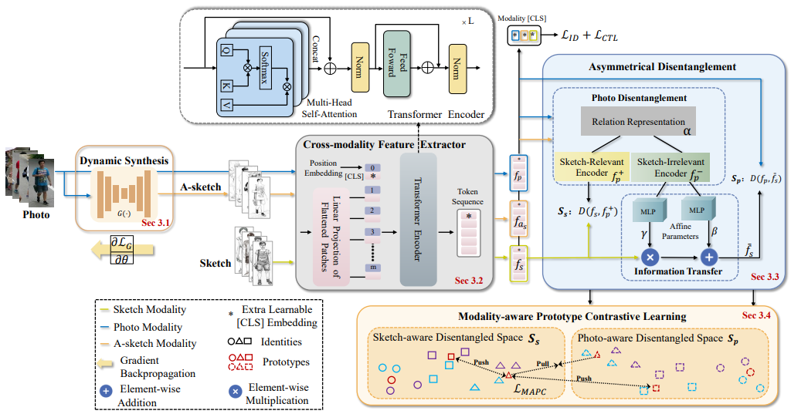
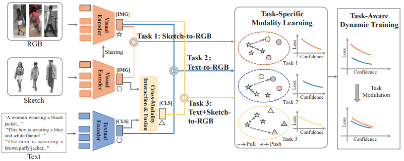
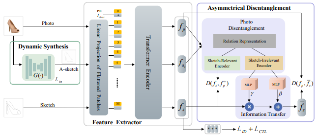
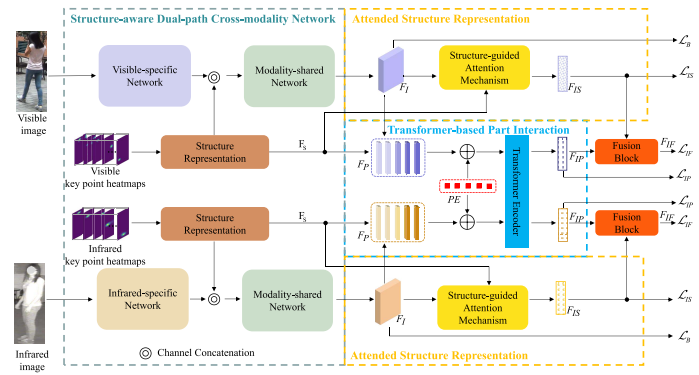
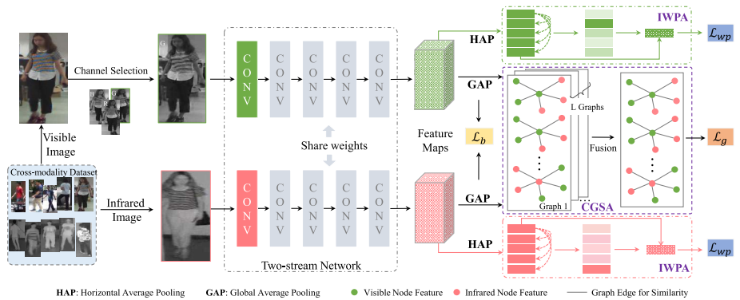
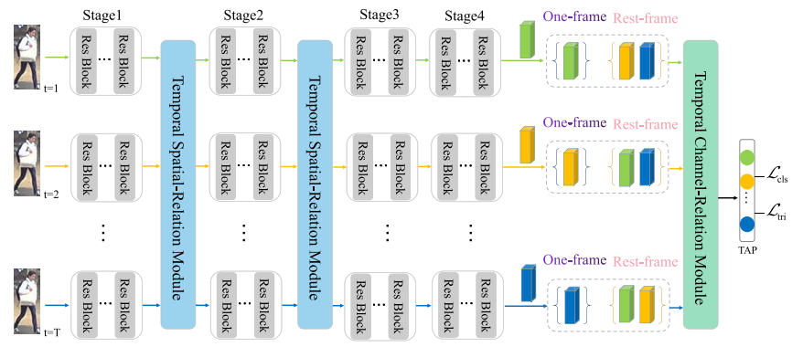

**Sketch-photo Recognition/Re-identification** 

--- | ---
 | ``TPAMI 2023`` [SketchTrans: Disentangled Prototype Learning with Transformer for Sketch-Photo Recognition.](https://ieeexplore.ieee.org/document/10328884) **Cuiqun Chen**, Mang Ye, Meibin Qi, Bo Du.
 | ``CVPR 2023`` [Towards Modality-Agnostic Person Re-Identification With Descriptive Query.](https://openaccess.thecvf.com/content/CVPR2023/papers/Chen_Towards_Modality-Agnostic_Person_Re-Identification_With_Descriptive_Query_CVPR_2023_paper.pdf) **Cuiqun Chen**, Mang Ye, Ding Jiang.
 | ``MM 2022`` [Sketch transformer: Asymmetrical disentanglement learning from dynamic synthesis.](https://dl.acm.org/doi/abs/10.1145/3503161.3547993) **Cuiqun Chen**, Mang Ye, Meibin Qi, Bo Du.

**Visible-infrared Person Re-identification**

 --- | ---
 | ``TIP 2022`` [Structure-aware positional transformer for visible-infrared person re-identification.](https://ieeexplore.ieee.org/abstract/document/9725265) **Cuiqun Chen**, Mang Ye, Meibin Qi, Jingjing Wu, Jianguo Jiang, Chia-Wen Lin.
 | ``TIFS 2021`` [Dynamic tri-level relation mining with attentive graph for visible infrared re-identification.](https://ieeexplore.ieee.org/abstract/document/9665382) Mang Ye, **Cuiqun Chen**, Jianbing Shen, Ling Shao.

**Video-based Person Re-identification**

 --- | ---
 | ``TCSVT 2022`` [Saliency and granularity: Discovering temporal coherence for video-based person re-identification.](https://ieeexplore.ieee.org/abstract/document/9729212) **Cuiqun Chen**, Mang Ye, Meibin Qi, Jingjing Wu, Yimin Liu, Jianguo Jiang.

